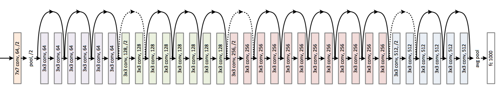
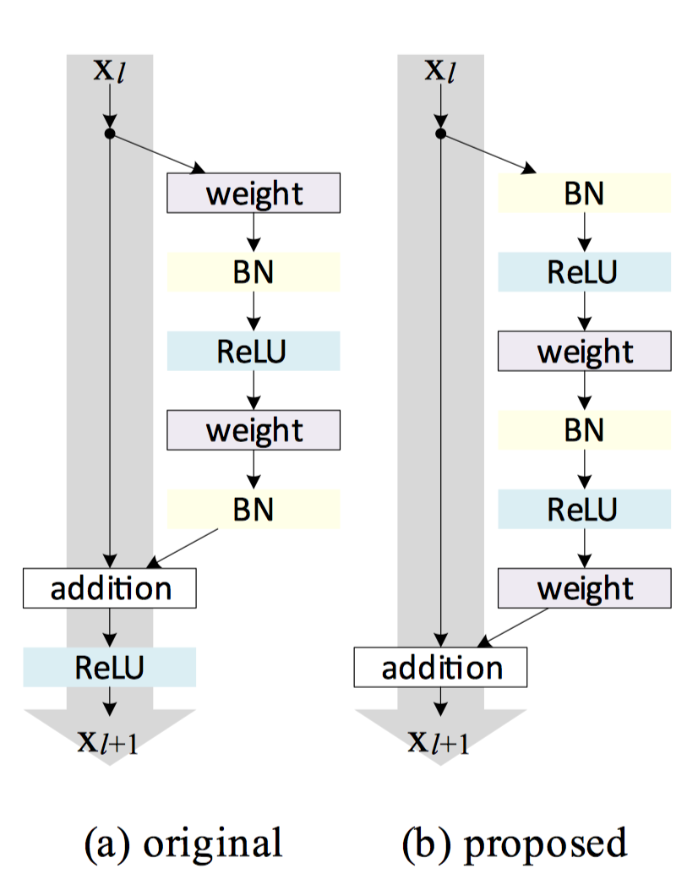

# keras-cnn
keras implementation of several CNN models.
- [1.  [SqueezeNet](https://github.com/DeepScale/SqueezeNet/tree/master/SqueezeNet_v1.1)](#1-squeezenethttpsgithubcomdeepscalesqueezenettreemastersqueezenetv11)
- [2. [DenseNet](https://github.com/liuzhuang13/DenseNet)](#2-densenethttpsgithubcomliuzhuang13densenet)
- [3. [ResNet](https://github.com/KaimingHe/deep-residual-networks)](#3-resnethttpsgithubcomkaiminghedeep-residual-networks)

## 1.  [SqueezeNet](https://github.com/DeepScale/SqueezeNet/tree/master/SqueezeNet_v1.1)
```
@article{SqueezeNet,
    Author = {Forrest N. Iandola and Song Han and Matthew W. Moskewicz and Khalid Ashraf and William J. Dally and Kurt Keutzer},
    Title = {SqueezeNet: AlexNet-level accuracy with 50x fewer parameters and $<$0.5MB model size},
    Journal = {arXiv:1602.07360},
    Year = {2016}
}
```

  
**Figure 1:** Squeeze and expand filters in a fire module.

  
**Figure 2:** Fire module architecture. (from [Netscope](http://ethereon.github.io/netscope/quickstart.html))

### Training notes
In my dataset, SqueezeNet is super sensitive to learning rate, I'm using `Adam` optimizer and `lr=0.0003` is a good point to start with.

## 2. [DenseNet](https://github.com/liuzhuang13/DenseNet)
```
@inproceedings{huang2017densely,
  title={Densely connected convolutional networks},
  author={Huang, Gao and Liu, Zhuang and van der Maaten, Laurens and Weinberger, Kilian Q },
  booktitle={Proceedings of the IEEE Conference on Computer Vision and Pattern Recognition},
  year={2017}
}
```
  
**Figure 3:** A 5-layer dense block with a growth rate of `k = 4`.

  
**Figure 4:** A DenseNet with 4 dense blocks.

### Training nodes:
I'm using `Tensorflow` backend and the `tf.concate` will [allocate new memory for output](https://github.com/tensorflow/tensorflow/blob/master/tensorflow/core/kernels/concat_op.cc#L130) which is widely used in the Densenet. This cause the huge GPU memory usage while training a DenseNet model.


## 3. [ResNet](https://github.com/KaimingHe/deep-residual-networks)
```
@article{He2015,
  author = {Kaiming He and Xiangyu Zhang and Shaoqing Ren and Jian Sun},
  title = {Deep Residual Learning for Image Recognition},
  journal = {arXiv preprint arXiv:1512.03385},
  year = {2015}
}

@article{He2016,
  author = {Kaiming He and Xiangyu Zhang and Shaoqing Ren and Jian Sun},
  title = {Identity Mappings in Deep Residual Networks},
  journal = {arXiv preprint arXiv:1603.05027},
  year = {2016}
}
```
  
**Figure 5.** A 34-layer ResNet.

  
**Figure 6.** Original residual block and the 2016 proposed one.
